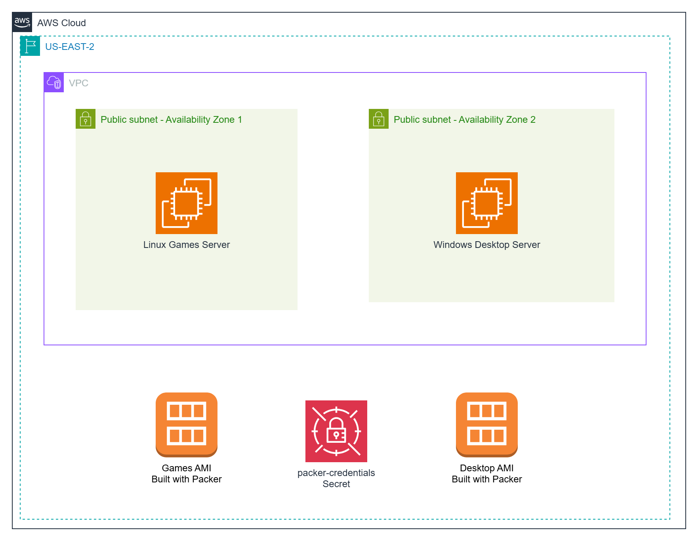
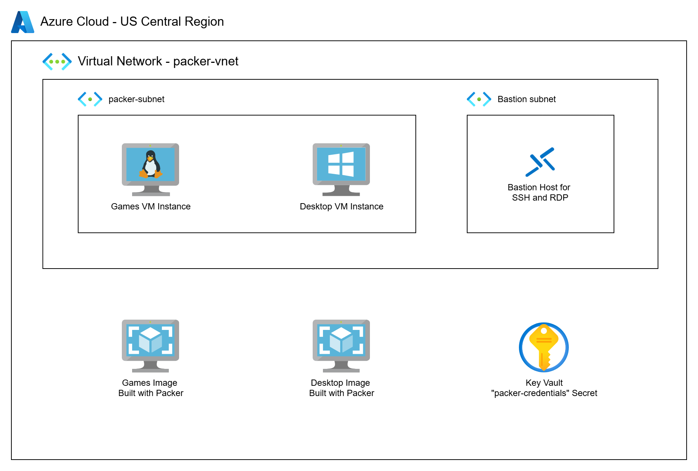
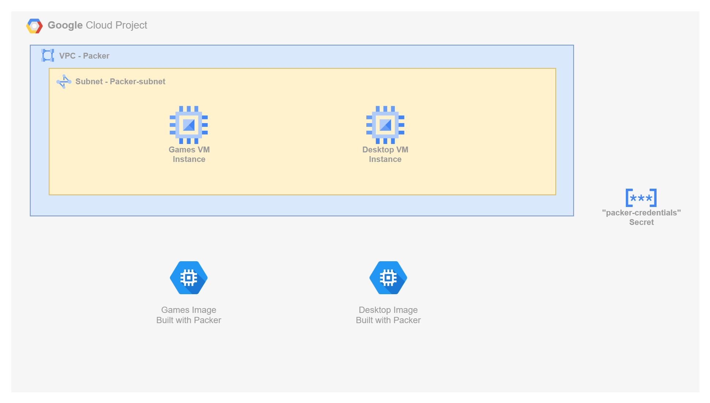

# Cross-Cloud Image Building with Packer  

In this series, we build and deploy **custom Linux and Windows images** across **AWS**, **Azure**, and **Google Cloud Platform**, using **HashiCorp Packer**.

## What You’ll Learn

- Automate image creation for **Ubuntu** and **Windows Server** with tailored cloud configurations.
- Apply the **latest Windows Updates** during image build — ensuring patched, secure deployments from day one.
- Handle **WinRM**, **Sysprep**, and firewall rules in Windows, with cloud-specific approaches.
- Install and configure services like **Apache** (Linux) and **Chrome/Firefox** (Windows).
- Create a local `packer` user with secure password management using cloud secrets.
- Deploy and test the images using **HTTP** access for Linux or **RDP** access for Windows.
- Work around Azure’s limitations by executing `CustomData.bin` through a VM extension — enabling consistent cross-cloud boot behavior.

---

This is a **complete working solution** for building reusable cloud images — easy to adapt and extend for your own projects.

## Quick Links

1. [Building Images with Packer](TBD)
2. AWS Solution
   - [Build AMIs with Packer](TBD)
   - [GitHub Project](https://github.com/mamonaco1973/aws-packer/)
3. Azure Solution
   - [Build Azure Images with Packer](TBD)
   - [GitHub Project](https://github.com/mamonaco1973/azure-packer/)
4. GCP Solution
   - [Build GCP Images with Packer](TBD)
   - [GitHub Project](https://github.com/mamonaco1973/gcp-packer/)

## AWS Image Build & Deployment

In the AWS solution, we use Packer to build both **Linux AMIs** and **Windows AMIs**.

- For **Linux**, we configure an Ubuntu-based image with Apache and deploy several retro HTML games.
- For **Windows**, we install Chrome and Firefox, apply the **latest Windows Updates**, and configure WinRM using a custom **user data script**.
- We use the built-in **EC2 Launch tool** to perform Sysprep on Windows images, ensuring a clean and reusable AMI every time.
- Both images are configured with **AWS Systems Manager (SSM)** support, allowing you to connect and debug directly from the AWS Console without needing SSH or RDP.
- The images are built inside a user-defined **VPC and subnet**, which is created beforehand.
- We test deployments by accessing the Linux instance over **HTTP (port 80)** and the Windows instance via **RDP** using a local `packer` account with a secure password.

## Azure Image Build & Deployment

In the Azure solution, we build and deploy custom **Ubuntu** and **Windows** images using Packer.

- For **Linux**, we create an Ubuntu image with Apache installed and deploy several 80’s-style HTML games.
- For **Windows**, we install Chrome and Firefox, apply the **latest Windows Updates**, and prepare the system using **Sysprep with PowerShell** commands.
- Azure doesn’t allow direct execution of PowerShell in `custom_data`, so we implement a workaround: we drop a PowerShell script as `CustomData.bin` and use a lightweight **VM extension** to execute it at boot.
- Networking is provisioned automatically by Packer using a temporary **resource group and VNet**, simplifying initial setup.
- We deploy an **Azure Bastion host** to securely interact with both Linux and Windows VMs from the Azure Portal — eliminating the need to expose public IPs or manage SSH/RDP keys manually.
- The Windows image supports **RDP** access using a local `packer` account, and the Linux image can be accessed via **HTTP** on port 80.

## GCP Image Build & Deployment

In the GCP solution, we use Packer to build and deploy custom **Linux** and **Windows** images to Compute Engine.

- For **Linux**, we create an Ubuntu-based image with Apache installed and deploy several retro-style HTML games.
- For **Windows**, we install Chrome and Firefox, apply the **latest Windows Updates**, and execute **Sysprep** using native PowerShell commands.
- GCP **automatically installs WinRM**, but additional setup is required — we use a **metadata startup script** to set the WinRM password and configure authentication.
- We define a **custom firewall rule** to allow WinRM traffic (TCP 5986) so that the Windows instance is accessible for remote management.
- Image builds run within a custom **VPC and subnet** that are pre-provisioned to support isolated, controlled access.
- The Windows image supports **RDP** access using a local `packer` account, and the Linux image is tested via **HTTP** on port 80.

