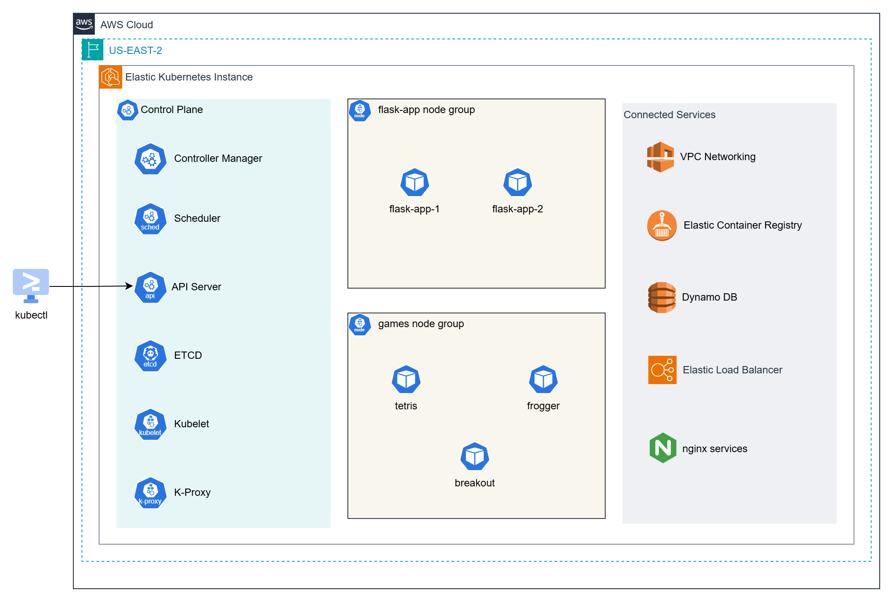
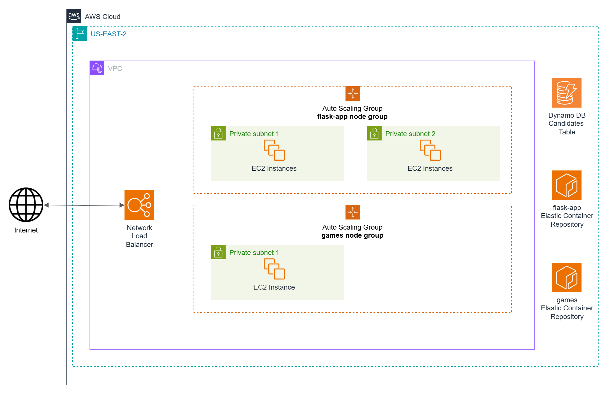
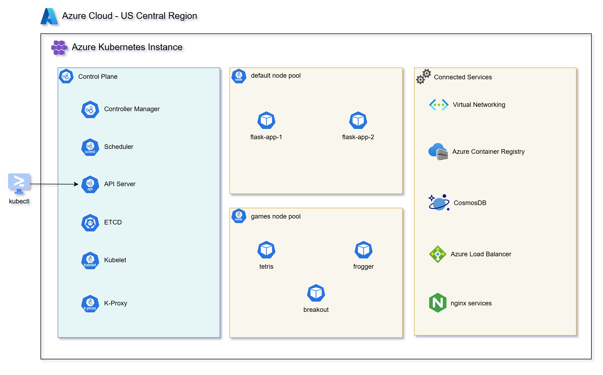
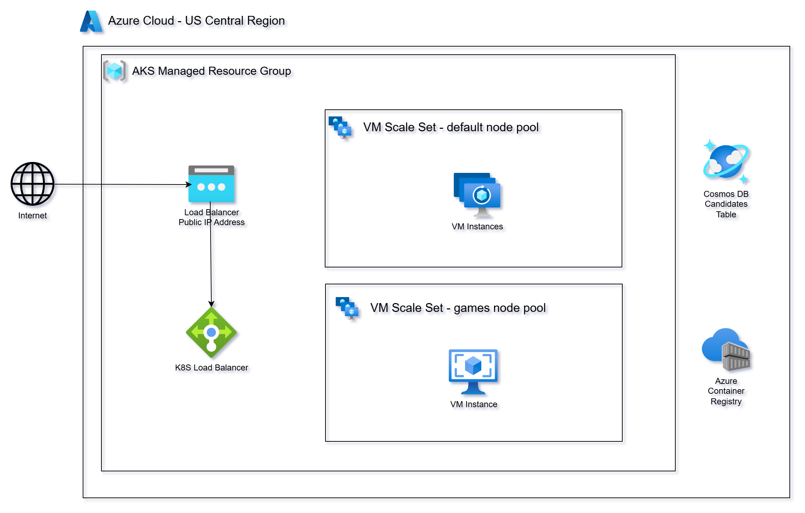
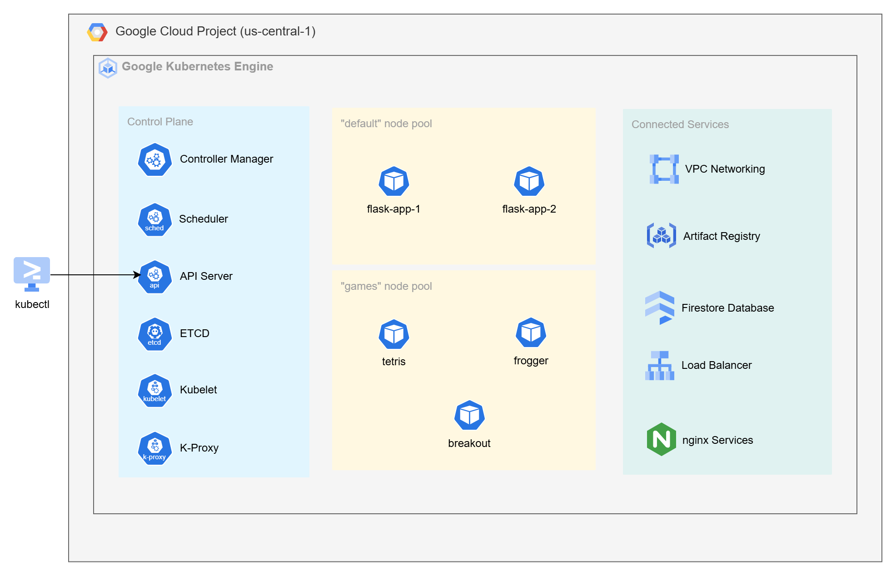
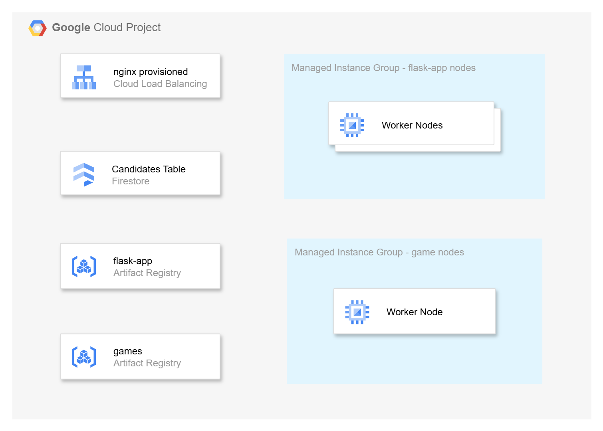
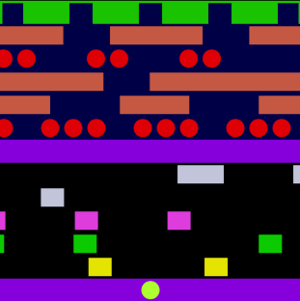
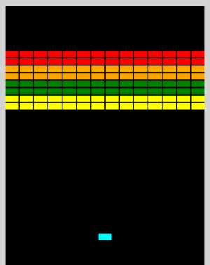

# Containerizing Applications Using Kubernetes in The Cloud

**This video series complements the [Scaling in the Cloud](https://github.com/mamonaco1973/cloud-scaling-intro/blob/main/README.md) and the [Simple Cloud Containers](https://github.com/mamonaco1973/container-intro/blob/main/README.md) series**, where we deployed a simple Python-based microservice using the Flask framework across different cloud platforms.

In this new series, we'll take that same microservice and containerize it using **Docker**, then deploy it to **Kubernetes clusters** running on the managed Kubernetes services provided by each cloud platform.

This is a **fully automated deployment** of containerized microservices and web apps across AWS, Azure, and GCP — powered by infrastructure-as-code and cloud-native tooling.

We'll build and deploy:

- **A document database-backed microservice** using:
  - **DynamoDB** for AWS  
  - **CosmosDB** for Azure  
  - **Firestore** for GCP  

- **A Docker container** for the Flask microservice, optimized for Kubernetes deployments.

- **Additional standalone Docker containers** that run classic JavaScript games like **Tetris**, **Frogger**, and **Breakout**.

- **Cloud-native container registry workflows**, pushing images to:
  - **Amazon ECR (Elastic Container Registry)**  
  - **Azure Container Registry (ACR)**  
  - **Google Artifact Registry (GAR)**  

- **Kubernetes workloads on managed clusters**, deploying everything to:
  - **Amazon EKS**  
  - **Azure AKS**  
  - **Google GKE**  

- **Kubernetes manifests** including **Deployments**, **Services**, and **Ingress** resources for scalable, fault-tolerant workloads.

- **NGINX as a unified Ingress controller**, exposing all services and games behind a single Load Balancer per cloud.

## Quick Links

1. [Kubernetes In The Cloud](https://youtu.be/6A-DO_ymDQI)
2. AWS Solution
   - [Elastic Kubernetes Service](https://youtu.be/Tl2y86V5XSQ)
   - [GitHub Project](https://github.com/mamonaco1973/aws-k8s/)
3. Azure Solution
   - [Azure Kubernetes Service](https://youtu.be/LhFiK1otC7o)
   - [GitHub Project](https://github.com/mamonaco1973/azure-k8s/)
4. GCP Solution
   - [Google Kubernetes Engine](https://youtu.be/ALOM53zq-lw)
   - [GitHub Project](https://github.com/mamonaco1973/gcp-k8s/)

## Are Cloud Kubernetes Services PaaS or IaaS?

When deploying Kubernetes in the cloud using **Amazon EKS**, **Azure AKS**, or **Google GKE**, you might wonder:

> Are these services considered Infrastructure as a Service (IaaS) or Platform as a Service (PaaS)?

They let you configure compute and scaling options — that sounds like IaaS. But they also manage the control plane, provision infrastructure for you, and abstract away much of the operational burden — that sounds like PaaS.

The most accurate answer is that they provide a **PaaS experience built on top of IaaS foundations** — blending declarative APIs with automated provisioning and deep integration into each cloud provider’s infrastructure.

---

### Managed Control Plane, Declarative Infrastructure

With EKS, AKS, and GKE, you never install or operate the Kubernetes control plane. It’s fully managed by the cloud provider, including upgrades, high availability, monitoring, and security.

You don’t provision VMs manually. Instead, you declare the size, shape, and behavior of node pools, and the service provisions infrastructure on your behalf. From the user’s point of view, it’s a **declarative, hands-off experience**, which is characteristic of **PaaS**.

---

### Autoscaling and VM Management: Still IaaS Under the Hood

While you don't manage VMs directly, **EKS, AKS, and GKE rely on IaaS mechanisms** to provision and scale worker nodes:

- **EKS** uses **Auto Scaling Groups (ASGs)**
- **AKS** uses **Virtual Machine Scale Sets (VMSS)**
- **GKE** uses **Managed Instance Groups (MIGs)**

You define node pool specs and scaling policies. The service then orchestrates compute resources using these backend scaling services. These mechanisms provide:

- VM provisioning and auto-repair  
- Auto-scaling based on cluster metrics  
- Rolling upgrades and zone-aware scheduling  

These are deeply rooted in IaaS — but you’re shielded from the details by the Kubernetes abstraction.

---

### Load Balancer Provisioning

Kubernetes makes exposing applications easy with `Service` objects of type `LoadBalancer`. In cloud environments:

- AWS automatically provisions an **Elastic Load Balancer**.
- Azure creates an **Azure Load Balancer**.
- GCP provisions a **Network Load Balancer**.

You don’t create or configure these resources directly — the Kubernetes cloud controller manager (CCM) does it for you. It wires the load balancer to your cluster and configures health checks, backend pools, and IP management based on annotations and service specifications.

This is another hallmark of PaaS: you describe the need, and the infrastructure is created and managed for you.

---

### Tagging: The Glue That Holds It Together

To coordinate this complex choreography, these services **heavily use resource tagging**:

- Tags help the control plane track which VMs, disks, and load balancers belong to which cluster or node pool.
- They’re used for:
  - **Auto-discovery of subnets, routes, and firewalls**
  - **Identifying orphaned resources for cleanup**
  - **Routing traffic in cloud-native DNS and load balancing setups**

For example:
- In **EKS**, tags on subnets help determine which ones are usable by worker nodes.
- In **AKS**, tags on VMSS instances allow the Kubernetes autoscaler to track and modify node pools.
- In **GKE**, labels and metadata help glue together instance templates, MIGs, and firewall rules.

You don’t typically manage these tags directly — the platform applies and manages them behind the scenes. But they are essential for the orchestration of cloud-native Kubernetes.

---

### Conclusion

Cloud Kubernetes services follow a “managed, not fully abstracted” philosophy:

- You don’t install or maintain the control plane.
- But you can see and control the infrastructure it runs on.

By contrast, services like Managed Databases or Managed Active Directory are designed around a “fully abstracted” model where all infrastructure is hidden.

## AWS Solution

This diagram shows an **Amazon EKS cluster** in **US-EAST-2**, with a control plane, two node groups (`flask-app` and `games`), and pods running apps like `flask-app-1` and `tetris`. It connects to services like **VPC**, **ECR**, **DynamoDB**, **Load Balancer**, and **NGINX**, and is managed via `kubectl`.

This diagram shows the AWS infrastructure behind the EKS cluster, with EC2-based node groups in private subnets, a Network Load Balancer for internet traffic, and connected services like DynamoDB and Elastic Container Registry.

## Azure Solution

This diagram shows an **Azure Kubernetes Service (AKS)** cluster in the **US Central region**, with a managed control plane, two node pools (`default` and `games`), and pods like `flask-app-1` and `tetris`. It integrates with **Virtual Networking**, **Azure Container Registry**, **CosmosDB**, **Azure Load Balancer**, and **NGINX**, and is managed using `kubectl`.

This diagram shows the **underlying Azure infrastructure** supporting the AKS cluster. It includes two **VM Scale Sets** for the `default` and `games` node pools, managed within an **AKS resource group**. Traffic from the **internet** flows through a public **Load Balancer** to a **Kubernetes Load Balancer**, which distributes it to the VM instances. It also connects to **Cosmos DB** and **Azure Container Registry** to support the applications running in the cluster.

## GCP Solution

This diagram shows a **Google Kubernetes Engine (GKE)** cluster in **us-central-1**, with a managed control plane, two node pools (`default` and `games`), and pods like `flask-app-1` and `tetris`. It connects to **VPC Networking**, **Artifact Registry**, **Firestore Database**, **Load Balancer**, and **NGINX services**, and is managed using `kubectl`.

This diagram shows the **infrastructure behind the GKE cluster**, with two **Managed Instance Groups** powering the `flask-app` and `game` node pools. It integrates with **Cloud Load Balancing** (provisioned by NGINX), **Firestore** for data storage, and **Artifact Registry** for hosting container images of `flask-app` and `games`.

## Service Endpoint Summary

### `/flask-app/api/gtg` (GET)
- **Purpose**: Health check.
- **Response**: 
  - `{"connected": "true", "instance-id": <instance_id>}` (if `details` query parameter is provided).
  - 200 OK with no body otherwise.

### `/flask-app/api/<name>` (GET)
- **Purpose**: Retrieve a candidate by name.
- **Response**: 
  - Candidate details (JSON) with status `200`.
  - `"Not Found"` with status `404` if no candidate is found.

### `/flask-app/api/<name>` (POST)
- **Purpose**: Add or update a candidate by name.
- **Response**: 
  - `{"CandidateName": <name>}` with status `200`.
  - `"Unable to update"` with status `500` on failure.

### `/flask-app/api/candidates` (GET)
- **Purpose**: Retrieve all candidates.
- **Response**: 
  - List of candidates (JSON) with status `200`.
  - `"Not Found"` with status `404` if no candidates exist.

### `/games/tetris` (GET)
 - **Purpose**: Loads javascript tetris game for usage in a Web Browser.

      

### `/games/frogger` (GET)
 - **Purpose**: Loads javascript frogger game for usage in a Web Browser.

      

### `/games/breakout` (GET)
 - **Purpose**: Loads javascript breakout game for usage in a Web Browser.

      
